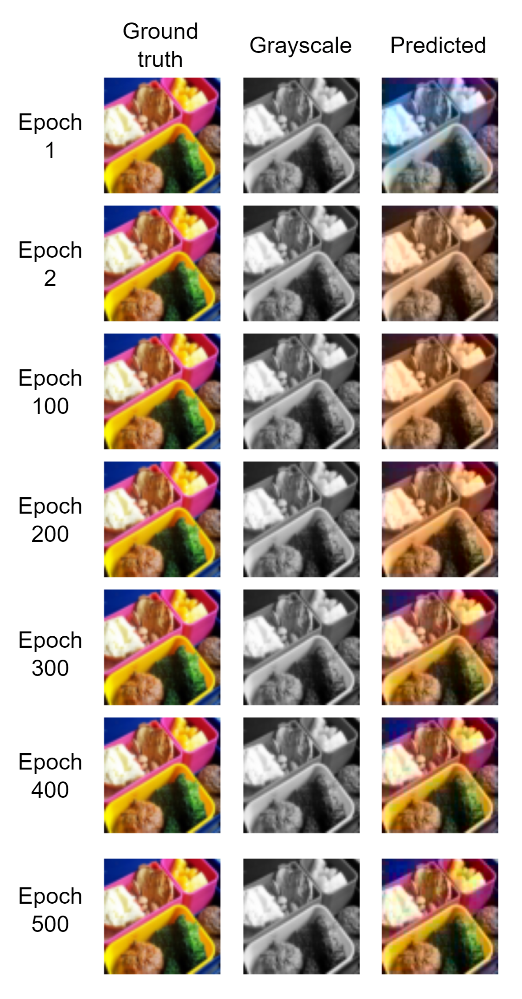
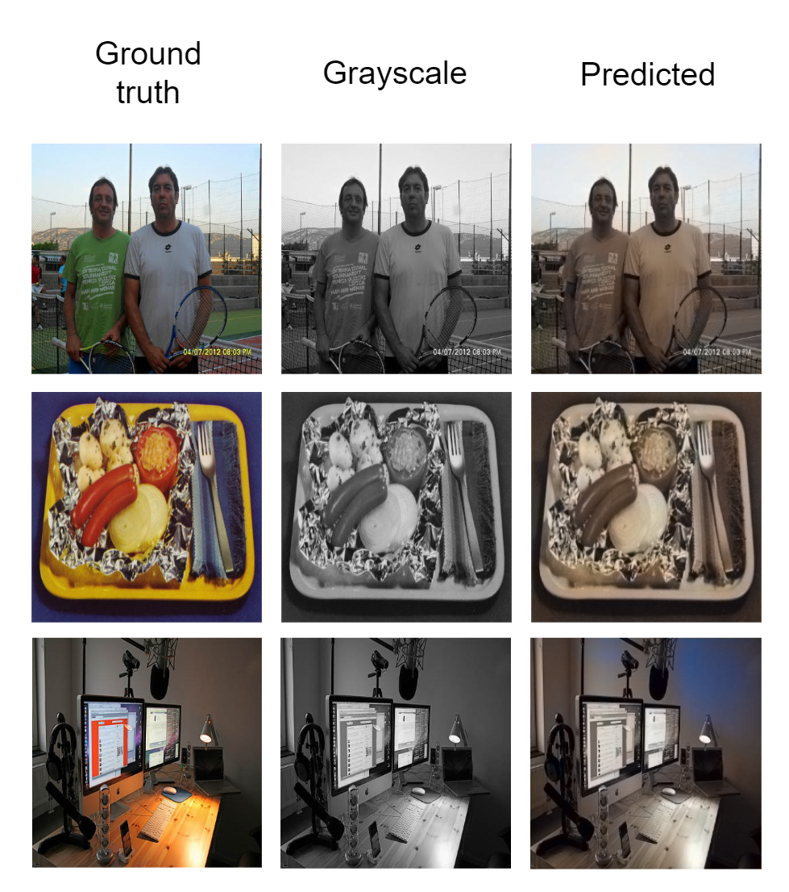

# ColorED

  <a href="README.md">English</a> |
  Español

Implementación de una Red Neuronal Convolucional (CNN) con topología Encoder-Decoder para la tarea de colorziación de imágenes. Proyecto desarrollado para la asignatura Visión por Computador del máster MUIARFID (UPV).

Se ha seguido el siguiente artículo como referencia:

-  [Colorizing B&W Photos with Neural Networks. Emil Wallner. 2017](https://blog.floydhub.com/colorizing-b-w-photos-with-neural-networks/)

Para facilitar la inferencia del color por parte del decoder, a los filtros de cada píxel de la última capa convolucional se les concatena la salida de una InceptionResNet preentrenada con ImageNet. De esta manera, incluimos la información semántica de la imagen.

Para esta tarea se ha usado como base el [código proporcionado en la asignatura]((https://github.com/RParedesPalacios/ComputerVisionLab/blob/master/src/colorization.py)).

## Datos

Se ha utilizado un [dataset disponible en Kaggle](https://www.kaggle.com/datasets/aayush9753/image-colorization-dataset) con imágenes RGB variadas (5000 para training y 739 para test).

## Preprocesamiento

Las imágenes son redimensionadas a 256x256, normalizadas y convertidas al espacio de color Lab. El canal de luminancia (L) será usado como entrada al encoder y los canales de color (ab) serán usados para calcular el error cuadrático medio respecto a la salida obtenida (MSE).

El generador de datos encargado de proporcionar cada batch realiza las siguientes tareas:

1.  Leer las imágenes RGB de memoria.

2.  Normalizar el color de \[0,255\] a \[0,1\].

3.  Aplicar data augmentation.

4.  Obtener una imagen RGB en escala de grises a partir de la imagen RGB a color normalizada.

5.  Obtener los embeddings de la InceptionResNet para cada imagen RGB en escala de grises.

6.  Convertir la imagen de RGB a color normalizada al espacio de color Lab.

7.  Separar los canales de luminancia (L) y color (ab).

8.  Normalizar el color de \[-128,128\] a \[-1,1\] para los canales ab.

Se utiliza [Albumentations](https://github.com/albumentations-team/albumentations) para hacer data augmentation a las imágenes originales. Hemos utilizado transformaciones de escalado, rotación y desplazamiento pero ninguna que afecte al color.

## Modelo

### Encoder

Se compone de 3 bloques de 2 capas convolucionales donde la primera capa reduce a la mitad la dimensión de la imagen (strides=2) y duplica los filtros del bloque anterior. Con esto llegamos a una capa convolucional de 32x32 dimensiones y 512 filtros. Después usamos una nueva capa convolucional sólo para reducir el número de filtros a 256 antes de concatenar la salida de InceptionResNet a los filtros de cada pixel.

### Decoder

El decoder es simétrico al encoder. Se compone de 3 bloques de 2 capas convolucionales + 1 reescalado, los cuales llevan a la imagen hasta los 128x128 píxeles y 16 filtros. Después se aplica una capa convolucional de 2 filtros que se corresponden con los dos canales de color (ab). La función de activación de esta última capa convolucional será la tangente hiperbólica para obtener valores entre -1 y 1, que después multiplicaremos por 128 para que los valores de los canales de color estén comprendidos entre 128 y -128 como se espera para el formato Lab. La salida de esa última capa convolucional son imágenes de 128x128 por lo que deberemos escalar las imágnees al doble para que las dimensiones de las imágenes a la entrada y a la salida coincidan.

## Pruebas

Para comprobar que la red aprende correctamente se ha implementado un callback que, cada 10 epochs, muestra una comparativa entre una imagen a color original, en escala de grises y a color inferido.

Para comprobar que no se ha cometido ningún fallo en el tratamiento de las imágenes, se ha creado un modelo simplificado, desactivado las transformaciones de data augmentation y reducido el tamaño del las imágenes a 64x64 píxeles, usando para training únicamente la primera imagen del dataset. Así la red memoriza muy rápidamente los colores de esa imagen. Con esta prueba hemos podido observar claramente cómo la red aprende los colores de una única foto.

## Resultados

Si usamos todas las imágenes, la red da una tonalidad sepia o marrón a todas las imágenes dado que el marrón es el color más común, sin llegar a generar colores vivos. Esto puede deberse a que el dataset tiene imágenes muy variadas aunque usando un dataset compuesto de imágenes de aviones, con poca variabilidad, el problema persiste, dando una tonalidad azulada por la presencia mayoritaria de colores azules en las imágenes de este otro dataset.

Además, los colores vivos requieren valores extremos en algún canal de color. Que una función de activación devuelva valores extremos requiere, por lo general, actualizar el peso de su neurona muchas veces. Por esto, en este tipo de redes es esperable obtener colores tenues si no dejamos que la red aprenda durante suficientes espochs. En este caso, después de 200 epochs, obtenemos los siguientes resultados.

Después de la epoch 25, la red ha aprendido a usar siempre el color más probable, bajando el loss pero empeorando la precisión. A partir de la epoch 150 la red aprende a mejorar la precisión que se obtendría coloreando aleatoriamente. Desde ese momento, tanto la loss como la precisión siguen una tendencia que nos indica que puede mejorar si se dejase entrenar por más epochs. En cualquier caso, esta tendencia es tan leve que tanto la bajada de loss como la mejora en la precisión se dan en rangos muy pequeños aun después de 200 epochs.

# Licencia

[MIT](LICENSE)
