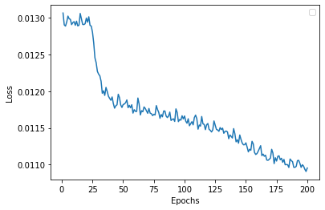

# ColorED

  English |
  <a href="README.es-ES.md">Español</a>

Implementation of a Convolutional Neural Network (CNN) with Encoder-Decoder topology for the task of image colorization. Project developed for the Computer Vision course of MUIARFID (UPV).

The following article has been used as reference:

-  [Colorizing B&W Photos with Neural Networks. Emil Wallner. 2017](https://blog.floydhub.com/colorizing-b-w-photos-with-neural-networks/)

To facilitate color inference by the decoder, the filters of each pixel of the last convolutional layer are concatenated with the output of an InceptionResNet pre-trained with ImageNet. In this way, we include the semantic information of the image.

For this task, the [code provided in the assignment](https://github.com/RParedesPalacios/ComputerVisionLab/blob/master/src/colorization.py) has been used as a basis.

## Dataset

A [dataset available in Kaggle with varied RGB images](https://www.kaggle.com/datasets/aayush9753/image-colorization-dataset) (5000 for training and 739 for test) has been used.

## Preprocessing

The images are resized to 256x256, normalized and converted to Lab color space. The luminance channel (L) will be used as input to the encoder and the color channels (ab) will be used to calculate the mean square error with respect to the obtained output (MSE).

The data generator in charge of providing each batch performs the following tasks:

1.  Reads the RGB images from memory.

2.  Normalizes the color from \[0.255\] to \[0.1\].

3.  Applies data augmentation.

4.  Obtains a grayscale RGB image from the normalized color RGB image.

5.  Obtains the embeddings of the InceptionResNet for each grayscale RGB image.

6.  Converts the normalized RGB-to-color image to the Lab color space.

7.  Separates the luminance (L) and color (ab) channels.

8.  Normalizes the color from \[-128,128\] to \[-1,1\] for the ab channels.

[Albumentations](https://github.com/albumentations-team/albumentations) is used to do data augmentation to the original images. It have been used scaling, rotation and displacement transformations but none affecting color.

## Model

### Encoder

It is composed of 3 blocks of 2 convolutional layers where the first layer halves the image dimension (strides=2) and duplicates the filters of the previous block. This results in a convolutional layer of 32x32 dimensions and 512 filters. We then use a new convolutional layer just to reduce the number of filters to 256 before concatenating the output of InceptionResNet to the filters of each pixel.

### Decoder

The decoder is symmetrical to the encoder. It consists of 3 blocks of 2 convolutional layers + 1 rescaling, which bring the image up to 128x128 pixels and 16 filters. Then a convolutional layer of 2 filters corresponding to the two color channels (ab) is applied. The activation function of this last convolutional layer will be the hyperbolic tangent (tanh) to obtain values between -1 and 1, which we will then multiplies by 128 so that the values of the color channels are between 128 and -128 as expected for the Lab format. The output of this last convolutional layer are images of 128x128 so we will have to scale the images to double so that the dimensions of the images at the input and output match.

## Tests

To check that the network learns correctly, a callback has been implemented. It shows, every 10 epochs, a comparison between an original color image, a grayscale image and an inferred color image.

To check that no error has been made in the image processing, a simplified model has been created, disabling the data augmentation transformations and reducing the size of the images to 64x64 pixels, using only the first image of the dataset for training. This way the network memorizes very quickly the colors of that image. With this test we have been able to clearly observe how the network learns the colors of a single picture.

## Results

If we use all the images, the network gives a sepia or brownish hue to all the images since brown is the most common color, without generating vivid colors. This may be due to the fact that the dataset has very varied images, although using a dataset composed of images of airplanes, with little variability, the problem persists, giving a bluish hue due to the presence of mostly blue colors in the images of this other dataset.

In addition, vivid colors require extreme values in some color channel. For an activation function to return extreme values usually requires updating weights many times. Therefore, in this type of networks, it is to be expected to obtain faint colors if we do not let the network learn for enough epochs. In this case, after 200 epochs, we obtain the following results.

After epoch 25, the network has learned to always use the most probable color, lowering the loss but worsening the accuracy. From epoch 150 onwards, the network learns to improve the accuracy that would be obtained by random coloring. From this point on, both loss and accuracy follow a trend that indicates that it could improve if it were allowed to train for more epochs. In any case, this trend is so slight that both the drop in loss and the improvement in accuracy occur in very small ranges even after 200 epochs.

# License

[MIT](LICENSE)
